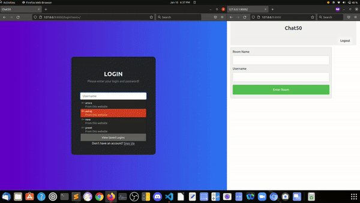

# Capstone aka Chat50
It is a real time web based chat app. You can create rooms with your friends and chat.

 
<a href="#">See it in action.</a>

## Installation
- You need to have **Django** installed on your local machine.
- Download this zip code.
- Go into this project's directory and run `python(or python3) manage.py runserver`.
- You'll be able to run the application.
- To install django on your machine, [click here](https://docs.djangoproject.com/en/3.2/topics/install/).
- To link database to your webapp run `python(or python3) manage.py makemigrations auctions` and then `python(or python3) manage.py migrate`.

## Usage
- After running the application, you need to register (if you're new a user) to use the webapp.
- Then the index page will load which needs you to type the **room** name and the **username** by which you want to enter in the room. 
- The **room** will be created if it doesn't exist and if it exists you'll enter that room.
- You can type your messages in the message box and clicking on **send** button will send your messages. All of the users will be able to see the messages in the real time without reloading the page.

## Structure/Design of program
This is a real time chat app. It is coded in Django and Javascript. HTML and CSS are used for styling and layout purposes.
 
Main files:
 
* *manage.py* - It contains all the required configurations to run your webapp.
* *chat50/static* - It include the required styling css page to help user to have a good experience of the webapp.
* *chat50/templates* - These include all the html pages of the webapp from a basic layout file to each and every html page of the webapp and internal **javascript** has been included in this.
* *chat50/models.py* - It contains all the database tables that django will handle to store information in it. The **Rooms** and **Messages** tables are included in this.
* *chat50/views.py* - It contains all the logic behind rendering the required pages upon request and acting as a mediator between databse and user. First is the **login** view that will be loaded to the user to login and if its the new user **register** view will load. Once the user has logged in they will see the index page (login required) which contains the form which you need to fill to enter a room. Then it will check whether the entered **room** exists or not if it doesn't, it will create one and the view will be redirected to **room**.
After you've entered the room, you have the option to send messages. When you type in the message and click on **send** button it'll head to the **send** function and then **getMessages** will load all the messages in real time using ajax.
* *chat50/urls.py* - It has all the urls that a user can request to visit the pages of the webapp.

There are other supporting files as well.

## Distinctiveness and Complexity:
- This projects is distinct from Pizza, Network, and Commerce Project because this isn't any place where people can list out their items and sell and nor the place to post out stuffs and connect with each other. This is a real time chat app where people can create rooms and have a real time chat without requiring to reload the webpages.
- Chat50 utilises Django and its models on the backend. It ahs three models. One for the user to login and logout. Second for creating the rooms to chat. And third for the messages. It also utilised Javascript mainly ajax to query out the messages in real time so that user does not have to reload the pages to see the newer messages.
- It is mobile-responsive because it uses bootstrap for layout and some additional css properties to make it look better in all the devices.

## Preview

## Finally

Thanks for all people who made CS50's Web Programming with Python and JavaScript possible. 
